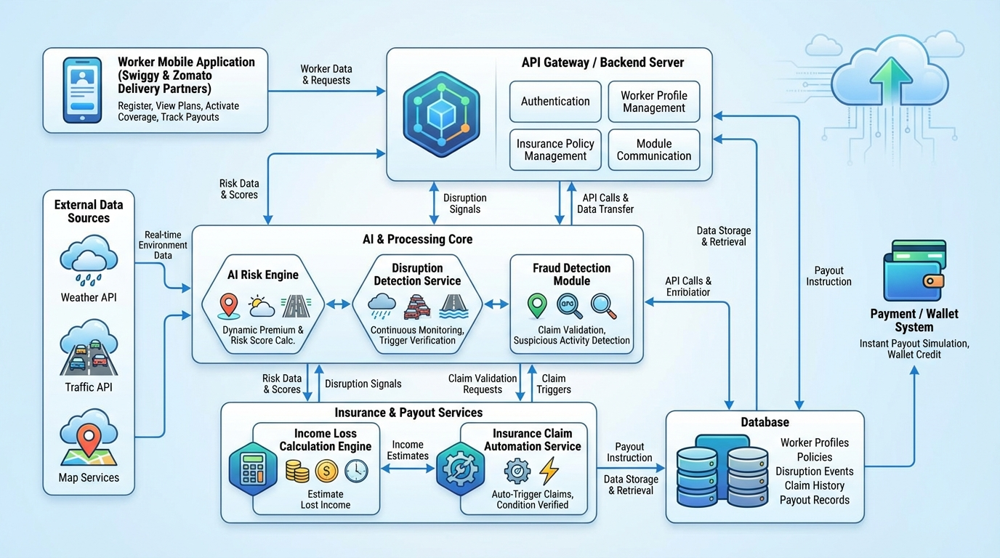
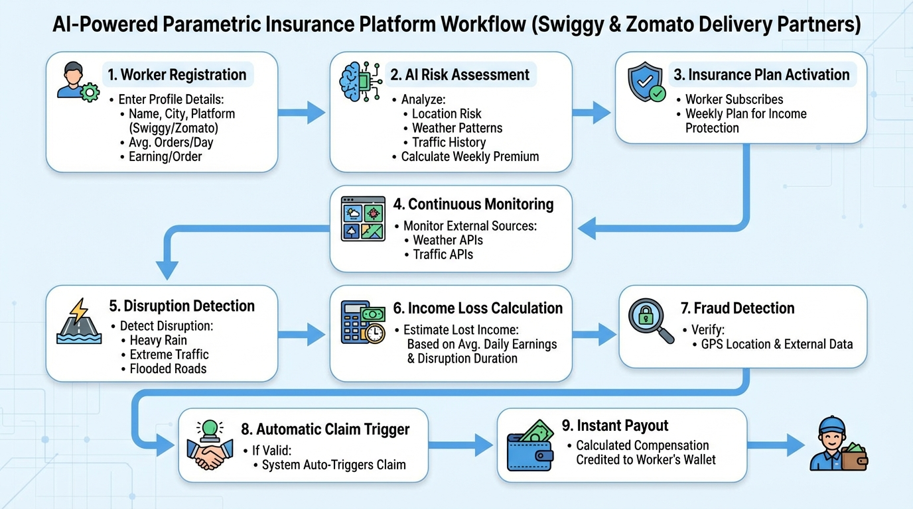

# 🛡️ DeliverShield AI
### AI-Powered Parametric Income Insurance for Food Delivery Partners

> Protecting the livelihoods of Swiggy & Zomato delivery partners from income loss caused by external disruptions — automatically, instantly, and intelligently.

---

## 📋 Table of Contents

1. [The Problem](#-the-problem)
2. [Our Solution](#-our-solution)
3. [Who We're Building For](#-who-were-building-for)
4. [Real-World Scenarios](#-real-world-scenarios)
5. [Weekly Pricing Model](#-weekly-pricing-model)
6. [Parametric Trigger Logic](#-parametric-trigger-logic)
7. [AI & ML Design](#-ai--ml-design)
8. [System Architecture](#-system-architecture)
9. [How It Works — End to End](#-how-it-works--end-to-end)
10. [Fraud Detection](#-fraud-detection)
11. [Tech Stack](#-tech-stack)
12. [Why DeliverShield AI](#-why-delivershield-ai)
13. [Constraints Compliance](#-constraints-compliance)

---

## 🚨 The Problem

India's food delivery partners — the people delivering your Swiggy and Zomato orders — earn their entire income through completed deliveries. There is no base salary. No sick leave. No safety net.

When external disruptions hit — a heavy monsoon downpour, a dangerous heatwave, flash flooding, or a sudden curfew — these workers are forced off the road. Their income drops to zero. And nobody compensates them for it.

| Attribute | Detail |
|-----------|--------|
| **Persona** | Swiggy / Zomato food delivery partner |
| **City** | Hyderabad (and other Tier 1 / Tier 2 cities) |
| **Daily Earnings** | ₹700 – ₹900 (18–22 orders × ₹35–₹45 per order) |
| **Working Hours** | 10:00 AM – 10:00 PM |
| **Income Model** | Per-delivery commission only — zero earnings if not working |
| **Risk Exposure** | Heavy rain, extreme heat, flooding, curfews |

External disruptions reduce gig workers' monthly earnings by **20–30%** with absolutely no recourse. Traditional insurance is too slow, too complex, and was never designed for workers who operate week-to-week on daily cash.

> **The gap:** No affordable, automated income protection product exists for India's 5 million+ food delivery partners. DeliverShield AI fills that gap.

---

## 💡 Our Solution

**DeliverShield AI** is a parametric income insurance platform. Workers pay a small weekly premium. When an external disruption hits their delivery zone, the system detects it automatically, calculates their income loss, and pays them instantly — with no claim form, no investigation, no waiting.

This is **parametric insurance**: the payout is triggered by an objective external event crossing a defined threshold, not by a subjective claim from the worker.

| Traditional Insurance | DeliverShield AI |
|----------------------|-----------------|
| Worker files a manual claim | System detects disruption automatically |
| Investigation & approval needed | AI validates against real-time external data |
| Payout in days or weeks | Payout within minutes |
| Subjective assessment | Objective trigger threshold |
| High administrative overhead | Zero-touch, fully automated |

---

## 👤 Who We're Building For

### Persona: Arjun — Zomato Delivery Partner, Hyderabad

Arjun has been delivering for Zomato for two years. He works 12-hour days, averaging 20 orders at ₹40 each — **₹800 a day**. That money feeds his family.

During monsoon season, Arjun loses 3–5 hours to heavy rain almost every week. That's ₹200–₹350 gone with no warning and no compensation. He can't plan around it. He can't save enough to absorb it consistently. He just loses.

**DeliverShield AI gives Arjun a safety net he can afford — ₹59 a week — that pays him back automatically every time the rain takes his income.**

---

## 🌧️ Real-World Scenarios

### Scenario 1 — Heavy Rain

```
📍 Kukatpally, Hyderabad | 6:30 PM (dinner peak)

Rainfall hits 18mm/hr.

→ OpenWeatherMap API detects threshold breach (> 15mm/hr)
→ Worker GPS confirmed in active delivery zone
→ Disruption window: 3.5 hours
→ Income loss: ₹800 ÷ 12hrs × 3.5hrs = ₹233
→ Fraud check: passed ✅
→ ₹233 credited to Arjun's wallet by 6:35 PM
→ Notification: "Heavy rain in your area. ₹233 payout processed."
```

### Scenario 2 — Extreme Heat

```
📍 LB Nagar, Hyderabad | 12:00 PM

Temperature reaches 44°C and holds for 4 hours.

→ Threshold breach detected (> 42°C for 3+ hrs)
→ Disruption window: 4 hours (12 PM – 4 PM)
→ Income loss: ₹800 ÷ 12hrs × 4hrs = ₹267
→ ₹267 credited instantly
→ Safety alert: "Extreme heat advisory. Your coverage is active."
```

### Scenario 3 — Curfew / Zone Closure

```
📍 Old City, Hyderabad | 2:00 PM

Local curfew imposed. Delivery zone closed.

→ Government alert API detects zone closure
→ Worker's GPS confirmed inside affected zone
→ All disrupted hours covered
→ Income loss calculated and payout triggered instantly
```

---

## 💰 Weekly Pricing Model

Gig workers live week-to-week. A monthly or annual premium doesn't fit their cash reality. Our pricing is structured on a **7-day basis** — buy on Monday, covered until Sunday.

### Plans

| Plan | Weekly Premium | Max Weekly Payout | Coverage |
|------|---------------|-------------------|----------|
| 🥉 Basic Shield | ₹39 / week | ₹500 | Up to 2 disruption events |
| 🥈 Standard Shield | ₹59 / week | ₹800 | Up to 3 disruption events |
| 🥇 Premium Shield | ₹79 / week | ₹1,200 | Unlimited disruption events |

> Standard Shield costs **less than ₹10/day** — less than one missed delivery.

### Dynamic Premium — How AI Adjusts Your Price

The weekly premium isn't one-size-fits-all. Our AI engine adjusts it based on the worker's specific delivery zone and risk history:

```
Weekly Premium = Base Rate
               + Location Risk Score    ← flood zone, waterlogging history
               + Seasonal Risk Factor   ← monsoon multiplier (June–Sept)
               + Historical Loss Rate   ← zone-level claim data, past 90 days
               − Safe Zone Discount     ← reward for low-disruption zones
```

| Worker Zone | Adjustment | Final Premium |
|-------------|-----------|--------------|
| Banjara Hills (low flood risk) | −₹5 safe zone | **₹54/week** |
| Kukatpally (flood-prone) | +₹10 flood, +₹5 monsoon | **₹74/week** |
| Jubilee Hills (moderate) | +₹3 historical | **₹62/week** |

---

## ⚡ Parametric Trigger Logic

We monitor 4 disruption types that directly impact food delivery work:

| # | Trigger | Threshold | Income Loss Formula |
|---|---------|-----------|-------------------|
| 1 | 🌧️ Heavy Rain | > 15mm/hr sustained OR > 100mm/day | Hours disrupted × hourly earning rate |
| 2 | 🌡️ Extreme Heat | > 42°C sustained for 3+ hours | Disruption hours × hourly rate |
| 3 | 🌊 Flood Alert | Official alert = TRUE OR waterlogging depth > 15cm | All hours until alert cleared |
| 4 | 🚧 Curfew / Zone Closure | Government zone closure = TRUE | All active hours in closed zone |

Every trigger requires **confirmation from 2 independent data sources** before a payout fires. This prevents false claims from single-point API errors.

```python
def evaluate_trigger(worker_location, conditions):
    if conditions["rainfall_mm_hr"] > 15:
        return claim(reason="HEAVY_RAIN")

    if conditions["temp_celsius"] > 42 and conditions["heat_duration_hrs"] >= 3:
        return claim(reason="EXTREME_HEAT")

    if conditions["flood_alert"] or conditions["waterlog_depth_cm"] > 15:
        return claim(reason="FLOOD_ALERT")

    if conditions["zone_closed"]:
        return claim(reason="ZONE_CLOSURE")

    return None
```

---

## 🧠 AI & ML Design

### 1. Risk Profiling Engine — Dynamic Premium Calculation

- **Algorithm:** XGBoost (Gradient Boosting Regressor)
- **Inputs:** Worker delivery zone, historical rainfall data (2 years), city flood maps, seasonal patterns, past disruption event frequency
- **Output:** Risk score (0–100) that maps directly to the weekly premium adjustment
- **Retraining:** Weekly, as new claim data accumulates

### 2. Income Loss Estimation

- **Algorithm:** Rule-based engine with Linear Regression for edge cases
- **Inputs:** Registered orders/day, earning/order, day-of-week multiplier (weekends earn ~25% more), confirmed disruption hours
- **Formula:** `Loss = (Daily Income ÷ Working Hours) × Disrupted Hours × Day Multiplier`
- **Output:** Exact ₹ amount credited to the worker

### 3. Fraud Detection — Isolation Forest

- **Algorithm:** Isolation Forest (unsupervised anomaly detection)
- **Why not rules?** Rule-based fraud checks only catch known fraud patterns. Isolation Forest learns what normal looks like and flags anything genuinely unusual — including fraud types we didn't explicitly anticipate
- **Inputs:** GPS logs, claim timestamps, weather event records, historical claim frequency per worker
- **Output:** Anomaly score (0–1). Score above 0.75 flags the claim for review

---

## 🏗️ System Architecture


### External APIs

| API | Purpose |
|-----|---------|
| OpenWeatherMap | Real-time rainfall, temperature, weather alerts (free tier) |
| India Meteorological Dept (IMD) | Official flood and severe weather alerts (public feed) |
| TomTom Traffic API | Congestion and zone closure data (mock acceptable) |
| Google Maps Geocoding | Worker GPS → delivery zone mapping |
| Razorpay Test Mode | Simulated instant UPI payout (sandbox) |

### Why PWA, Not Native App?

We chose a React Progressive Web App because it installs on Android without app store approval, deploys instantly from GitHub, and works seamlessly on the mid-range Android phones most delivery workers use.

---


## System Workflow



## 🛡️ Fraud Detection

| Fraud Type | How We Catch It |
|-----------|----------------|
| **GPS Spoofing** | Compare claimed location against cell tower triangulation and platform last-known GPS |
| **Fake Weather Claim** | Cross-validate claim timestamp with IMD / OpenWeatherMap historical archive for that exact coordinate |
| **Claim Clustering** | Flag when 20+ workers in the same micro-zone claim simultaneously without matching weather data |
| **Duplicate Claims** | SHA-256 hash of `(worker_id + event_id)` enforced at database level — one claim per event, always |
| **Inactive Worker Claim** | If the worker had zero app activity in the 60 minutes before the disruption, flag for review |

The Isolation Forest model scores every claim on a 0–1 anomaly scale. A score above 0.75 holds the payout for human review. This approach continuously learns from real data — getting smarter as the platform grows.

---

## ⚙️ Tech Stack

| Layer | Technology | Why |
|-------|-----------|-----|
| Frontend | React.js + Tailwind CSS (PWA) | Fast, responsive, Android-installable |
| Backend | Python — FastAPI | Async, event-driven, easy to scale |
| Database | PostgreSQL | Relational model fits insurance data perfectly |
| AI / ML | XGBoost, Scikit-learn, Pandas | Industry-standard, well-documented |
| Weather API | OpenWeatherMap + IMD | Free tier sufficient for demo |
| Traffic API | TomTom (mock acceptable) | Zone closure and congestion data |
| Payment | Razorpay Test Mode | Instant payout simulation |
| Hosting | Vercel (frontend) + Render (backend) | Free tiers, GitHub deploy |

---

## ✨ Why DeliverShield AI

| Feature | DeliverShield AI | Typical Approach |
|---------|-----------------|-----------------|
| Claim process | Zero-touch — fully automated | Manual form submission |
| Fraud detection | Isolation Forest ML model | Rule-based checks only |
| Pricing | AI dynamic pricing per delivery zone | Fixed flat rate |
| Payout speed | Instant (minutes after trigger) | Days after manual review |
| Worker alerts | Morning risk forecast + safety alerts | None |
| Admin view | Predictive 7-day disruption forecast | Basic claim count |

We designed this to work like a real insurance product — not a hackathon prototype. The worker never has to do anything after subscribing. The system earns their trust by just working.

---

## ✅ Constraints Compliance

| Rule | Our Implementation |
|------|-------------------|
| **Income loss coverage only** — no health, accident, life, or vehicle | Every trigger and payout is strictly tied to lost working income. No health or vehicle components exist in the system. |
| **Weekly pricing model** | All plans are 7-day subscriptions. No monthly or annual options. |
| **Single delivery persona** | Swiggy / Zomato food delivery partners only. |
| **AI/ML integration** | XGBoost for premium pricing, Isolation Forest for fraud, Linear Regression for income loss estimation. |
| **Parametric automation** | No manual claim process — end-to-end automated from detection to payout. |
| **Mock APIs acceptable** | OpenWeatherMap free tier + mock APIs for traffic and platform data. |

---

<div align="center">

**DeliverShield AI**
*Because every delivery partner deserves a safety net.*

</div>
