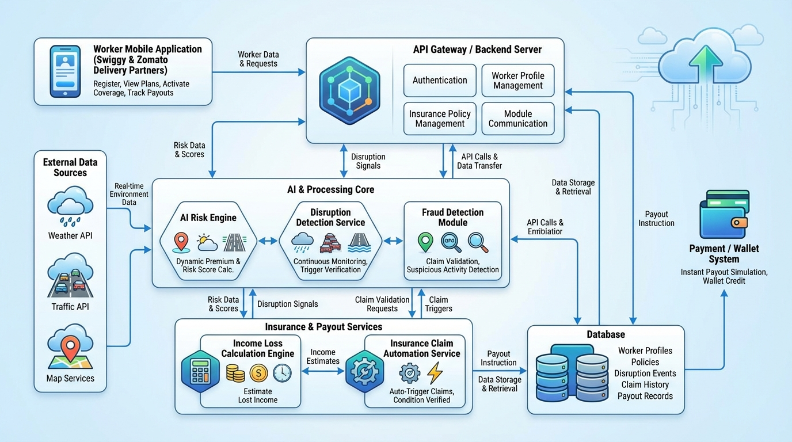
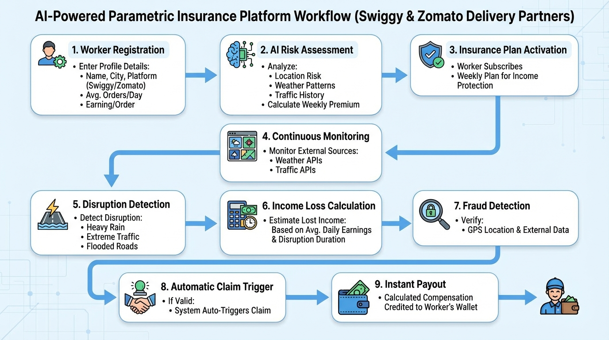

# 🛡️ DeliverShield AI
### AI-Powered Parametric Income Insurance for Food Delivery Partners

> Protecting the livelihoods of Swiggy & Zomato delivery partners from income loss caused by external disruptions — automatically, instantly, and intelligently.

---

## 📋 Table of Contents

1. [The Problem](#-the-problem)
2. [Our Solution](#-our-solution)
3. [Who We're Building For](#-who-were-building-for)
4. [Real-World Scenarios](#-real-world-scenarios)
5. [Weekly Pricing Model](#-weekly-pricing-model)
6. [Parametric Trigger Logic](#-parametric-trigger-logic)
7. [AI & ML Design](#-ai--ml-design)
8. [System Architecture](#-system-architecture)
9. [How It Works — End to End](#-how-it-works--end-to-end)
10. [Fraud Detection](#-fraud-detection)
11. [Adversarial Defense & Anti-Spoofing Strategy](#-adversarial-defense--anti-spoofing-strategy)
12. [Demo Flow](#-demo-flow)
13. [Tech Stack](#-tech-stack)
14. [Why DeliverShield AI](#-why-delivershield-ai)
15. [Constraints Compliance](#-constraints-compliance)
16. [Future Roadmap](#-future-roadmap)

---

## 🚨 The Problem

India's food delivery partners — the people delivering your Swiggy and Zomato orders — earn their entire income through completed deliveries. There is no base salary. No sick leave. No safety net.

When external disruptions hit — a heavy monsoon downpour, a dangerous heatwave, flash flooding, or a sudden curfew — these workers are forced off the road. Their income drops to zero. And nobody compensates them for it.

| Attribute | Detail |
|-----------|--------|
| **Persona** | Swiggy / Zomato food delivery partner |
| **City** | Hyderabad (and other Tier 1 / Tier 2 cities) |
| **Daily Earnings** | ₹700 – ₹900 (18–22 orders × ₹35–₹45 per order) |
| **Working Hours** | 10:00 AM – 10:00 PM |
| **Income Model** | Per-delivery commission only — zero earnings if not working |
| **Risk Exposure** | Heavy rain, extreme heat, flooding, curfews |

External disruptions reduce gig workers' monthly earnings by **20–30%** with absolutely no recourse. Traditional insurance is too slow, too complex, and was never designed for workers who operate week-to-week on daily cash.

> **The gap:** No affordable, automated income protection product exists for India's 5 million+ food delivery partners. DeliverShield AI fills that gap.

---

## 💡 Our Solution

**DeliverShield AI** is a parametric income insurance platform. Workers pay a small weekly premium. When an external disruption hits their delivery zone, the system detects it automatically, calculates their income loss, and pays them instantly — with no claim form, no investigation, no waiting.

This is **parametric insurance**: the payout is triggered by an objective external event crossing a defined threshold, not by a subjective claim from the worker.

| Traditional Insurance | DeliverShield AI |
|----------------------|-----------------|
| Worker files a manual claim | System detects disruption automatically |
| Investigation & approval needed | AI validates against real-time external data |
| Payout in days or weeks | Payout within minutes |
| Subjective assessment | Objective trigger threshold |
| High administrative overhead | Zero-touch, fully automated |

---

## 👤 Who We're Building For

### Persona: Arjun — Zomato Delivery Partner, Hyderabad

Arjun has been delivering for Zomato for two years. He works 12-hour days, averaging 20 orders at ₹40 each — **₹800 a day**. That money feeds his family.

During monsoon season, Arjun loses 3–5 hours to heavy rain almost every week. That's ₹200–₹350 gone with no warning and no compensation. He can't plan around it. He can't save enough to absorb it consistently. He just loses.

**DeliverShield AI gives Arjun a safety net he can afford — ₹59 a week — that pays him back automatically every time the rain takes his income.**

---

## 🌧️ Real-World Scenarios

### Scenario 1 — Heavy Rain

```
📍 Kukatpally, Hyderabad | 6:30 PM (dinner peak)

Rainfall hits 18mm/hr.

→ OpenWeatherMap API detects threshold breach (> 15mm/hr)
→ Worker GPS confirmed in active delivery zone
→ Disruption window: 3.5 hours
→ Income loss: ₹800 ÷ 12hrs × 3.5hrs = ₹233
→ Fraud check: passed ✅
→ ₹233 credited to Arjun's wallet by 6:35 PM
→ Notification: "Heavy rain in your area. ₹233 payout processed."
```

### Scenario 2 — Extreme Heat

```
📍 LB Nagar, Hyderabad | 12:00 PM

Temperature reaches 44°C and holds for 4 hours.

→ Threshold breach detected (> 42°C for 3+ hrs)
→ Disruption window: 4 hours (12 PM – 4 PM)
→ Income loss: ₹800 ÷ 12hrs × 4hrs = ₹267
→ ₹267 credited instantly
→ Safety alert: "Extreme heat advisory. Your coverage is active."
```

### Scenario 3 — Curfew / Zone Closure

```
📍 Old City, Hyderabad | 2:00 PM

Local curfew imposed. Delivery zone closed.

→ Government alert API detects zone closure
→ Worker's GPS confirmed inside affected zone
→ All disrupted hours covered
→ Income loss calculated and payout triggered instantly
```

---

## 💰 Weekly Pricing Model

Gig workers live week-to-week. A monthly or annual premium doesn't fit their cash reality. Our pricing is structured on a **7-day basis** — buy on Monday, covered until Sunday.

### Plans

| Plan | Weekly Premium | Max Weekly Payout | Coverage |
|------|---------------|-------------------|----------|
| 🥉 Basic Shield | ₹39 / week | ₹500 | Up to 2 disruption events |
| 🥈 Standard Shield | ₹59 / week | ₹800 | Up to 3 disruption events |
| 🥇 Premium Shield | ₹79 / week | ₹1,200 | Unlimited disruption events |

> Standard Shield costs **less than ₹10/day** — less than one missed delivery.

### Dynamic Premium — How AI Adjusts Your Price

The weekly premium isn't one-size-fits-all. Our AI engine adjusts it based on the worker's specific delivery zone and risk history:

```
Weekly Premium = Base Rate
               + Location Risk Score    ← flood zone, waterlogging history
               + Seasonal Risk Factor   ← monsoon multiplier (June–Sept)
               + Historical Loss Rate   ← zone-level claim data, past 90 days
               − Safe Zone Discount     ← reward for low-disruption zones
```

| Worker Zone | Adjustment | Final Premium |
|-------------|-----------|--------------|
| Banjara Hills (low flood risk) | −₹5 safe zone | **₹54/week** |
| Kukatpally (flood-prone) | +₹10 flood, +₹5 monsoon | **₹74/week** |
| Jubilee Hills (moderate) | +₹3 historical | **₹62/week** |

---

## ⚡ Parametric Trigger Logic

We monitor 4 disruption types that directly impact food delivery work:

| # | Trigger | Threshold | Income Loss Formula |
|---|---------|-----------|-------------------|
| 1 | 🌧️ Heavy Rain | > 15mm/hr sustained OR > 100mm/day | Hours disrupted × hourly earning rate |
| 2 | 🌡️ Extreme Heat | > 42°C sustained for 3+ hours | Disruption hours × hourly rate |
| 3 | 🌊 Flood Alert | Official alert = TRUE OR waterlogging depth > 15cm | All hours until alert cleared |
| 4 | 🚧 Curfew / Zone Closure | Government zone closure = TRUE | All active hours in closed zone |

Every trigger requires **confirmation from 2 independent data sources** before a payout fires. This prevents false claims from single-point API errors.

```python
def evaluate_trigger(worker_location, conditions):
    if conditions["rainfall_mm_hr"] > 15:
        return claim(reason="HEAVY_RAIN")

    if conditions["temp_celsius"] > 42 and conditions["heat_duration_hrs"] >= 3:
        return claim(reason="EXTREME_HEAT")

    if conditions["flood_alert"] or conditions["waterlog_depth_cm"] > 15:
        return claim(reason="FLOOD_ALERT")

    if conditions["zone_closed"]:
        return claim(reason="ZONE_CLOSURE")

    return None
```

---

## 🧠 AI & ML Design

### 1. Risk Profiling Engine — Dynamic Premium Calculation

- **Algorithm:** XGBoost (Gradient Boosting Regressor)
- **Inputs:** Worker delivery zone, historical rainfall data (2 years), city flood maps, seasonal patterns, past disruption event frequency
- **Output:** Risk score (0–100) that maps directly to the weekly premium adjustment
- **Retraining:** Weekly, as new claim data accumulates

### 2. Income Loss Estimation

- **Algorithm:** Rule-based engine with Linear Regression for edge cases
- **Inputs:** Registered orders/day, earning/order, day-of-week multiplier (weekends earn ~25% more), confirmed disruption hours
- **Formula:** `Loss = (Daily Income ÷ Working Hours) × Disrupted Hours × Day Multiplier`
- **Output:** Exact ₹ amount credited to the worker

### 3. Fraud Detection — Isolation Forest

- **Algorithm:** Isolation Forest (unsupervised anomaly detection)
- **Why not rules?** Rule-based fraud checks only catch known fraud patterns. Isolation Forest learns what normal looks like and flags anything genuinely unusual — including fraud types we didn't explicitly anticipate
- **Inputs:** GPS logs, claim timestamps, weather event records, historical claim frequency per worker
- **Output:** Anomaly score (0–1). Score above 0.75 flags the claim for review

---

## 🏗️ System Architecture


### External APIs

| API | Purpose |
|-----|---------|
| OpenWeatherMap | Real-time rainfall, temperature, weather alerts (free tier) |
| India Meteorological Dept (IMD) | Official flood and severe weather alerts (public feed) |
| TomTom Traffic API | Congestion and zone closure data (mock acceptable) |
| Google Maps Geocoding | Worker GPS → delivery zone mapping |
| Razorpay Test Mode | Simulated instant UPI payout (sandbox) |

### Why PWA, Not Native App?

We chose a React Progressive Web App because it installs on Android without app store approval, deploys instantly from GitHub, and works seamlessly on the mid-range Android phones most delivery workers use.

---

## System Workflow



## 🛡️ Fraud Detection

| Fraud Type | How We Catch It |
|-----------|----------------|
| **GPS Spoofing** | Compare claimed location against cell tower triangulation and platform last-known GPS |
| **Fake Weather Claim** | Cross-validate claim timestamp with IMD / OpenWeatherMap historical archive for that exact coordinate |
| **Claim Clustering** | Flag when 20+ workers in the same micro-zone claim simultaneously without matching weather data |
| **Duplicate Claims** | SHA-256 hash of `(worker_id + event_id)` enforced at database level — one claim per event, always |
| **Inactive Worker Claim** | If the worker had zero app activity in the 60 minutes before the disruption, flag for review |

The Isolation Forest model scores every claim on a 0–1 anomaly scale. A score above 0.75 holds the payout for human review. This approach continuously learns from real data — getting smarter as the platform grows.

---

## 🚨 Adversarial Defense & Anti-Spoofing Strategy

> *500 delivery partners. Fake GPS. Real payouts. DeliverShield AI was built to survive exactly this attack.*

A coordinated fraud ring targeting a parametric insurance platform doesn't look like one bad actor — it looks like a weather event. Dozens or hundreds of workers simultaneously claiming from the same zone, all with GPS coordinates conveniently inside the trigger boundary. Simple threshold checks fail here. Our defense is layered, probabilistic, and self-learning.

---

### 🗺️ Layer 1 — Multi-Source Location Verification

A GPS coordinate alone is never trusted. Every location claim is cross-validated across **three independent signals** before it contributes to a payout decision:

| Signal | Source | Failure Mode Caught |
|--------|--------|---------------------|
| Device GPS | Worker's phone | Easily spoofed via mock location apps |
| Cell Tower Triangulation | Telecom network (via platform SDK) | Independent of device GPS stack |
| Platform Last-Known Location | Swiggy / Zomato delivery app heartbeat | Corroborates recent physical presence |
| IP Geolocation | Request metadata | Catches emulator-based attacks from remote IPs |

A claim is **location-verified** only when at least 2 of these 3 independent signals place the worker within the affected zone. Single-source location claims are automatically held for manual review.

---

### 📡 Layer 2 — GPS Spoofing Detection

Mock location apps (e.g., Fake GPS, GPS Joystick) leave detectable fingerprints. Our spoofing detection module flags workers whose location data shows any of the following:

| Spoofing Signal | Detection Logic |
|-----------------|----------------|
| **Teleport jumps** | Movement of > 5 km in under 60 seconds — physically impossible on a city delivery bike |
| **Perfect coordinate stability** | Real GPS always drifts slightly; a location locked to identical decimal places for 10+ minutes is almost certainly injected |
| **Mock provider flag** | Android's `isFromMockProvider()` API surfaced via the delivery app SDK |
| **Emulator signature** | Device fingerprint patterns (missing sensors, atypical resolution) inconsistent with real mid-range Android hardware |

Workers flagged by 2 or more of these signals receive an anomaly score penalty. Three or more signals triggers an automatic payout hold.

---

### 🚶 Layer 3 — Movement Pattern Validation

A genuine delivery partner caught in a disruption event doesn't stand still. They attempt orders, idle near restaurants, or shelter nearby. They move like a human being trying to work in bad weather. Our movement coherence validator builds an expected mobility pattern from each worker's own historical GPS logs and flags deviations:

| Behavioral Signal | Normal | Suspicious |
|-------------------|--------|------------|
| GPS activity before disruption | Active delivery movement | Zero movement for 60+ min |
| Entry into zone relative to event | Was already operating in zone | Entered zone after event began |
| App activity (orders accepted/rejected) | Normal engagement | No app activity preceding claim |
| Exit behavior post-event | Resumes deliveries | No post-event movement |

---

### 🕸️ Layer 4 — Fraud Ring Detection via DBSCAN Clustering

Individual GPS spoofers are manageable. The harder attack is a **coordinated ring** — tens or hundreds of workers submitting claims simultaneously from the same zone using fabricated GPS. This looks statistically identical to a real weather event affecting many genuine workers. Standard anomaly detection fails here.

We use **DBSCAN (Density-Based Spatial Clustering of Applications with Noise)** to detect unnatural claim concentration patterns:

| Claim Pattern | Signature | Action |
|--------------|-----------|--------|
| **Organic event** | Claims spread gradually across a multi-km zone as workers are naturally dispersed | Normal — proceed |
| **Fraud ring** | 10+ workers clustered within a 100-metre radius, all claiming within a 5-minute window | Flag entire cluster for investigation |
| **Impossible density** | 100+ workers within 100m even with weather confirmed — physically cannot happen | Escalate regardless of weather data |

Clusters that lack a corresponding weather threshold breach at their exact centroid coordinates are escalated immediately. DBSCAN requires no predefined cluster count — it finds rings of any size organically.

---

### 🔢 Layer 5 — Trust Scoring System

Every worker maintains a **Trust Score (0–100)** that evolves with their behaviour on the platform. This score gates claim processing speed and payout priority — it does not silently block payouts. Every hold is communicated to the worker immediately.

```
Trust Score = Base Score (starts at 70)
            + Verified claim history        ← +2 per legitimate payout
            + Platform tenure               ← +1 per month, capped at +10
            + Multi-source location match   ← +3 per event
            − Anomaly flags                 ← −10 per Isolation Forest trigger
            − Spoofing signals              ← −20 per confirmed mock GPS detection
            − Fraud ring association        ← −30 if placed in a confirmed cluster
```

| Trust Band | Score | Claim Handling |
|------------|-------|---------------|
| 🟢 Trusted | 80–100 | Instant auto-payout |
| 🟡 Standard | 55–79 | Payout within 30 minutes, light verification |
| 🟠 Elevated Risk | 30–54 | Manual review queue, payout held up to 4 hours |
| 🔴 Flagged | 0–29 | Account suspended pending investigation |

Trust Scores recover over time through continued legitimate behaviour. A flagged worker is not permanently penalised — this is essential to fairness for those caught in false-positive situations.

---

### 🌐 Layer 6 — Cross-Verification with External APIs

No internal signal is treated as ground truth in isolation. Every payout trigger is cross-checked against at least two independent external data sources before finalisation:

| Verification Check | Primary Source | Secondary Source |
|--------------------|---------------|-----------------|
| Rainfall threshold | OpenWeatherMap (real-time) | IMD historical archive for that coordinate |
| Temperature threshold | OpenWeatherMap | IMD station data |
| Flood alert | IMD official alert feed | State Disaster Management Authority (SDMA) feed |
| Zone closure / curfew | TomTom Traffic API | Government public advisory feed |

A payout requires **both sources to confirm the event independently**. If only one source reports the threshold breach, the event is logged and the claim is queued for a 30-minute recheck window before a final decision is made.

---

### ⚖️ Layer 7 — Fairness Logic & False Positive Prevention

The hardest design problem in adversarial fraud detection is not catching fraud — it's **not punishing innocent workers**. A delivery partner stranded in a flooded lane with low GPS signal, or an older phone with positioning drift, should never be flagged as a fraud risk.

Our fairness logic is built around three non-negotiable principles:

1. **Benefit of the doubt threshold:** A worker must trigger at least 3 independent anomaly signals before a payout is held. A single suspicious signal generates a log entry only — never a block.
2. **Device-class awareness:** We maintain a device registry. Known low-end phones with weak GPS hardware receive wider coordinate tolerance windows. Anomaly thresholds are adjusted per device class, not applied uniformly.
3. **Appeal and auto-resolution:** Any worker whose payout is held receives an immediate in-app notification with the reason. If the hold is not resolved within 4 hours by the review team, the system auto-pays at 80% of the calculated amount — no innocent worker waits more than 4 hours without partial coverage.

---

### 🤖 AI Models Summary

| Model | Role | Why This Model |
|-------|------|---------------|
| **Isolation Forest** | Per-claim anomaly scoring | Unsupervised; detects novel fraud without labelled training data |
| **DBSCAN** | Fraud ring / cluster detection | Density-based; no predefined cluster count needed |
| **XGBoost** | Dynamic premium risk scoring | Handles non-linear feature interactions in zone risk data |
| **Linear Regression** | Income loss estimation | Interpretable, auditable — required for insurance compliance |
| **Rule Engine** | Movement pattern & spoofing flags | Fast, deterministic, zero-latency for hard signals |

The Isolation Forest and DBSCAN models are retrained weekly on new claim data. As the platform grows, the fraud detection layer gets proportionally smarter.

---

## 🎬 Demo Flow

> A step-by-step walkthrough of DeliverShield AI in a live demo scenario.

**Setup:** One browser window as the **Worker View (PWA)**, one as the **Admin Dashboard**. All external APIs are live (OpenWeatherMap free tier) or mocked where noted.

---

### Step 1 — Worker Onboards & Subscribes

```
→ Worker opens DeliverShield AI PWA on mobile (or browser)
→ Registers with name, Swiggy/Zomato partner ID, delivery zone (Kukatpally)
→ Sees personalised weekly premium: ₹74/week (flood-prone zone multiplier applied)
→ Selects "Standard Shield" plan
→ Pays ₹74 via Razorpay (Test Mode) — simulated UPI payment
→ Coverage confirmed: Active from today through Sunday
```

### Step 2 — Morning Risk Briefing

```
→ Worker receives push notification at 8:00 AM:
   "⛈️ High rain probability today in your zone (85%). Your coverage is active."
→ Opens app → sees Daily Risk Score: 72 / 100 (High)
→ Disruption forecast card: "Rain likely 5 PM – 8 PM"
```

### Step 3 — Disruption Event Fires (Live)

```
→ [Admin triggers mock weather event OR real OpenWeatherMap threshold crossed]
→ System polls OpenWeatherMap: rainfall = 18mm/hr ✅  (threshold: 15mm/hr)
→ System checks IMD archive for same coordinate: confirms ✅
→ Dual-source confirmation: PASSED

→ Worker GPS cross-checked: confirmed inside Kukatpally zone ✅
→ Cell tower triangulation: matches ✅
→ Platform last-known GPS: matches ✅
→ Multi-source location verification: 3/3 signals confirmed ✅

→ GPS spoof check: no teleport jumps, no mock provider flag ✅
→ Movement pattern: active delivery activity in past 45 min ✅
→ DBSCAN cluster check: worker not in any suspicious cluster ✅
→ Isolation Forest anomaly score: 0.12 (well below 0.75 threshold) ✅
→ Trust Score: 83 → Instant auto-payout path selected ✅
```

### Step 4 — Payout Processed

```
→ Disruption window: 3.5 hours
→ Income loss: ₹800 ÷ 12hrs × 3.5hrs = ₹233
→ ₹233 credited to worker's linked UPI via Razorpay Test Mode
→ Time from trigger detection to payout: ~18 seconds
→ Worker notification: "Heavy rain detected in Kukatpally. ₹233 credited to your account."
```

### Step 5 — Admin Dashboard View

```
→ Admin sees real-time event map: affected zone highlighted
→ Claim feed: 47 workers triggered in this event
→ Fraud panel: 2 workers flagged (anomaly score > 0.75), held for review
→ DBSCAN cluster alert: No suspicious clusters detected for this event
→ Total payout disbursed: ₹10,951 across 47 workers
→ Platform liquidity: Sufficient ✅
```

### Step 6 — Fraudulent Claim Attempt (Adversarial Demo)

```
→ [Demo: simulate a worker spoofing GPS into the zone from outside]

→ Device GPS: shows Kukatpally ← injected via mock location app
→ Cell tower data: places worker 8km away in Begumpet ❌
→ Platform last GPS: shows worker in Begumpet 12 min ago ❌
→ Multi-source location: only 1/3 signals confirm → LOCATION_UNVERIFIED ❌

→ GPS spoof detection:
   • Mock provider flag triggered on device ❌
   • Zero GPS drift over 8 minutes ❌
   • Spoof score: 65/100 → GPS_SPOOFING_DETECTED ❌

→ Movement pattern:
   • No app activity for 90 minutes before event ❌
   • Worker entered disruption zone 7 minutes AFTER event started ❌
   • MOVEMENT_PATTERN_INVALID ❌

→ Isolation Forest anomaly score: 0.89 → ISOLATION_FOREST_ANOMALY ❌

→ Active flags: 4 layers triggered
→ Fairness check: flag_count = 4 → HOLD_FULL_INVESTIGATION
→ Payout: BLOCKED. Worker notified immediately with reason.
→ Trust Score: −20 (mock GPS) −10 (Isolation Forest) → Elevated Risk band
→ Admin queue: case escalated for manual review
```

---

## ⚙️ Tech Stack

| Layer | Technology | Why |
|-------|-----------|-----|
| Frontend | React.js + Tailwind CSS (PWA) | Fast, responsive, Android-installable |
| Backend | Python — FastAPI | Async, event-driven, easy to scale |
| Database | PostgreSQL | Relational model fits insurance data perfectly |
| AI / ML | XGBoost, Scikit-learn, Pandas | Industry-standard, well-documented |
| Weather API | OpenWeatherMap + IMD | Free tier sufficient for demo |
| Traffic API | TomTom (mock acceptable) | Zone closure and congestion data |
| Payment | Razorpay Test Mode | Instant payout simulation |
| Hosting | Vercel (frontend) + Render (backend) | Free tiers, GitHub deploy |

---

## ✨ Why DeliverShield AI

| Feature | DeliverShield AI | Typical Approach |
|---------|-----------------|-----------------|
| Claim process | Zero-touch — fully automated | Manual form submission |
| Fraud detection | Isolation Forest ML model | Rule-based checks only |
| Pricing | AI dynamic pricing per delivery zone | Fixed flat rate |
| Payout speed | Instant (minutes after trigger) | Days after manual review |
| Worker alerts | Morning risk forecast + safety alerts | None |
| Admin view | Predictive 7-day disruption forecast | Basic claim count |

We designed this to work like a real insurance product — not a hackathon prototype. The worker never has to do anything after subscribing. The system earns their trust by just working.

---

## ✅ Constraints Compliance

| Rule | Our Implementation |
|------|-------------------|
| **Income loss coverage only** — no health, accident, life, or vehicle | Every trigger and payout is strictly tied to lost working income. No health or vehicle components exist in the system. |
| **Weekly pricing model** | All plans are 7-day subscriptions. No monthly or annual options. |
| **Single delivery persona** | Swiggy / Zomato food delivery partners only. |
| **AI/ML integration** | XGBoost for premium pricing, Isolation Forest for fraud, Linear Regression for income loss estimation. |
| **Parametric automation** | No manual claim process — end-to-end automated from detection to payout. |
| **Mock APIs acceptable** | OpenWeatherMap free tier + mock APIs for traffic and platform data. |

---

## 🚀 Future Roadmap

DeliverShield AI is designed as a production-grade platform, not a hackathon one-off. These are the next milestones on our build path:

| Priority | Feature | Description |
|----------|---------|-------------|
| 🔴 High | **Zomato / Swiggy API Integration** | Replace mock platform data with real order history and GPS feeds via official partner APIs — enabling precise income loss calculation per worker rather than zone averages |
| 🔴 High | **Federated Fraud Model** | Train the Isolation Forest model in a privacy-preserving federated setup across multiple city clusters — so fraud patterns learned in Mumbai improve detection in Hyderabad without sharing raw worker data |
| 🟡 Medium | **Regional Language Support** | Translate the PWA into Telugu, Hindi, Tamil, and Kannada — removing literacy and language friction for workers who are uncomfortable with English interfaces |
| 🟡 Medium | **Microinsurance Pool Model** | Introduce a worker-owned risk pool where premium surpluses at the end of each quarter are partially returned to subscribers — building long-term trust and reducing churn |
| 🟢 Standard | **Predictive Disruption Alerts via SMS** | Extend morning risk briefings to plain SMS for workers without smartphones or data — ensuring coverage awareness reaches the most underserved delivery partners |
| 🟢 Standard | **Multi-City Expansion with Zone Risk Atlas** | Build a live risk atlas covering Chennai, Bengaluru, Mumbai, and Kolkata — each with zone-level flood, heat, and historical claim maps to power accurate dynamic pricing at scale |

---

<div align="center">

**DeliverShield AI**
*Because every delivery partner deserves a safety net.*

</div>
